Last Friday (12.10.2018) was Spain's national holiday Día de la Hispanidad. A holiday where they celebrate the discovery America's from Christopher Columbus.  
But instead of celebrating this holiday with a big fiesta, I used the long weekend to travel to Spain's 3rd biggest city Valencia (around two million inhabitants), the capital of the same called county.

## Friday

### Travel

My train to Barcelona departed at 7:58 AM so I had the great idea to not sleep the whole night because my current sleep cycle looks like this:

_Go to sleep at 2 AM - wake up at 10 AM - stand up at 12 PM_

And since I knew that there was no chance of me waking up that early (even if I set an alarm clock) I used the time to watch Tokyo Ghoul.

I arrived in Barcelona at around 9:15 at Arc-de-Triomf from there the next stop was the bus station next to the train station. From there the bus took around 4.5 hours to drive from Barcelona to Valencia (short break included). I arrived at the hostel around 3 PM.

### Institutio d'Art Valencia

My first stop on my trip was an art museum in Valencia. From my point of view, the art was too abstract and I couldn't really follow what most of the galleries' artist wanted to tell me.

The first three or so galleries were really monotonous meaning the art pieces (mostly sculpture or meaningless images) were only in black, white and brown and had little to no colour to them. I get that this is an art style and this probably has some message behind it, but it honestly just bored me.

Crying sculpture

But to be fair there also were some galleries that I really enjoyed walking through. For example, there was an avantgardist gallery where artists criticized the Spanish government of the 40's (under Franco's regimes).

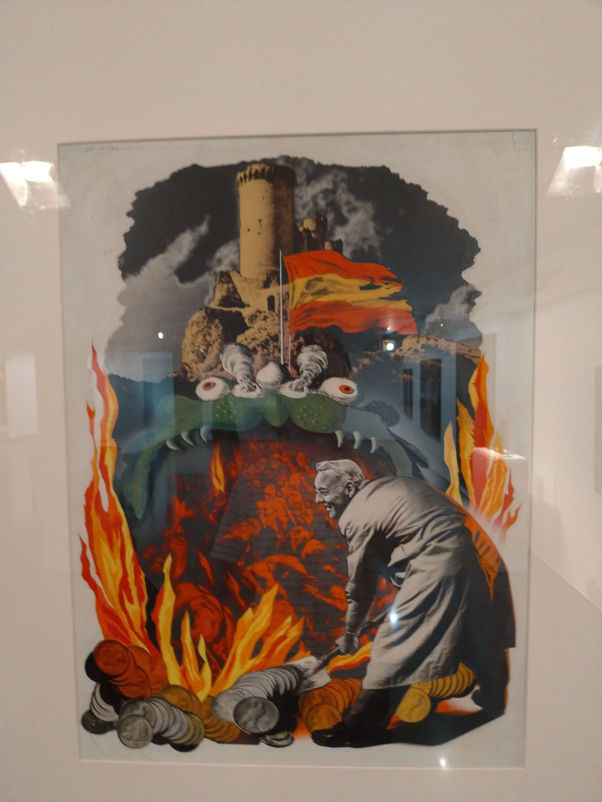

Arvantgarde Art 1/2

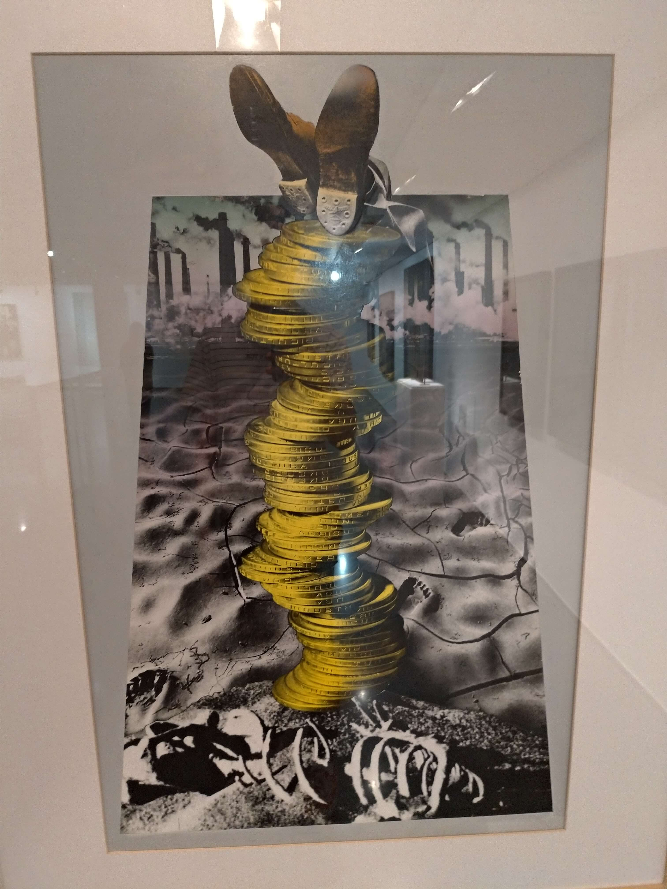

Arvantgarde Art 2/2

### Botanic Garden

Next stop on my bucket list was the botanic garden of Valencia. A beautiful garden that inhabits most of the Mediterranean plants that are growing in and/or around Valencia. It was really informative and interesting to walk through the garden and see some of the plants in Spain.

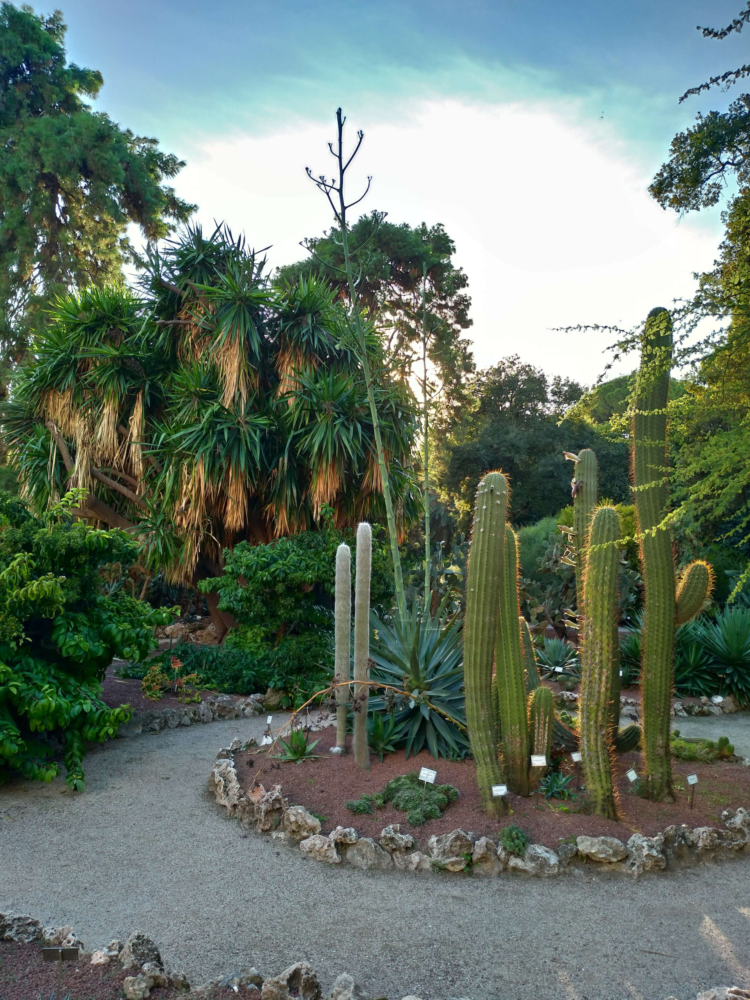

Botanic garden 1/2

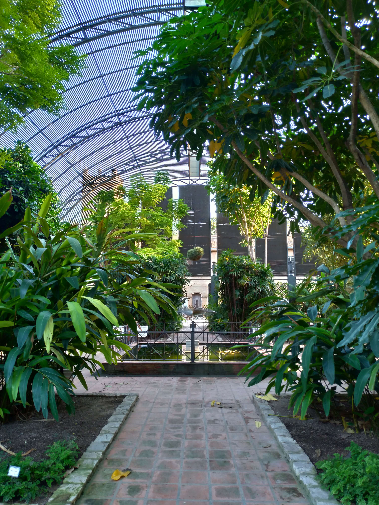

Botanic garden 2/2

After that I grabbed some food and went to bed because I was really tired.

## Saturday

### Tour me out

Center Valencia Youth Hostel (the hostel I lived in) is in a cooperation with a company called [Tour me out](http://www.tourmeout.com/en_GB/valencia). They offer pay-as-much-as-you-want city tours around Valencia and Barcelona (they are labelled as free tours).

I really enjoyed the tour because our tour guide was really funny and taught us not only about the history of the city or the history of different buildings, but also gave us off-tour recommendations what you can do in Valencia.

For example she told us when certain places are without admission or which if we walked past a restaurant she always gave us a hand sign if the restaurant is good and cheap or if it's just a tourist trap.

_Sidenote: She gave us a really good tip if you ever walk past a restaurant and see that the menu is written in English, it's most likely a tourist trap because local restaurants would never offer bi-lingual menus._

Llotja de la Seda

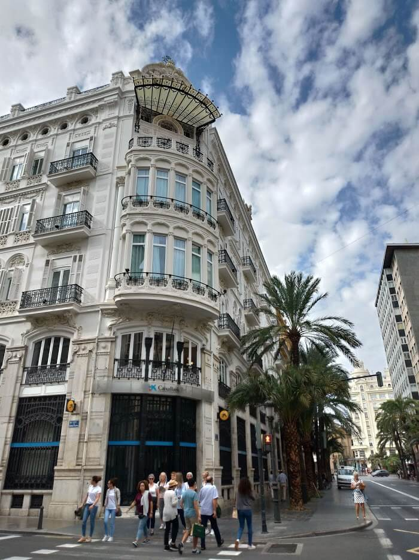

Building in Valencia

### El Mercado Central

Next stop was the city's regional market because I wanted to get some food for a picnic. The market was built at the beginning of the 19th century and is, with around 8000m² the second largest market in Europe. If you can't imagine anything that is 8000m² big, there are around 500 different food shops inside the market.

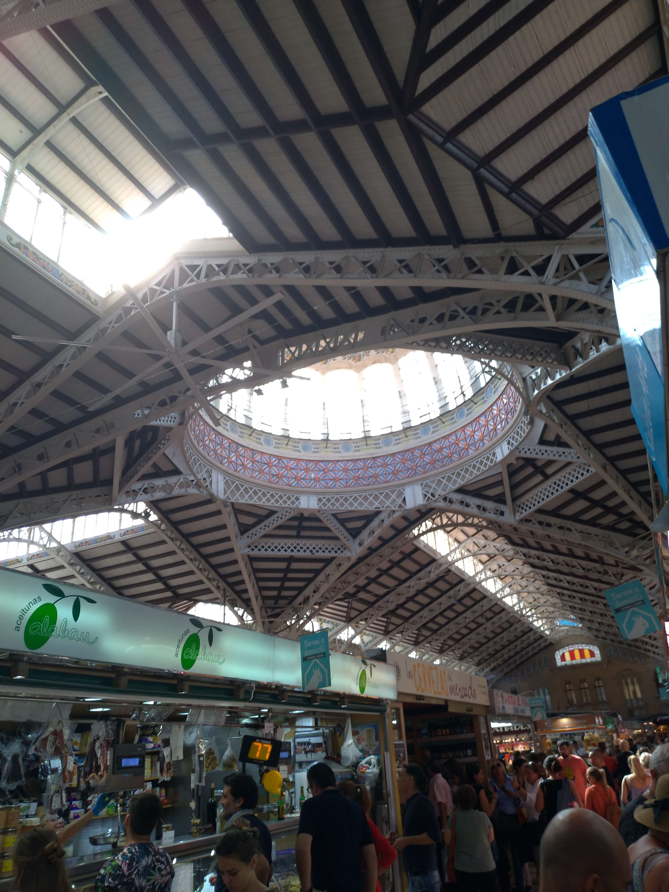

El Mercado Central

### Bike tour

After that, I rent a bike for 4 hours to drive to the beach through Valencia's huge park. The park originally was the old river Rio Turia, but because of floodings in the 1960s that cost 80 people their life's the government decided to redirect the river and make a park out of the empty riverbed.  Now there is a beautiful park with 1.100 km² instead of a high way that was planned during the dictatorship of Franco.

The City of Arts and Sciences consist of seven different buildings:

Inside the park is the city's famous _Ciutat de_ les _Arts_ i les _Ciències_ (City of Arts and Science) which was built and designed in 1988 by Santiago Calatrava and Félix Candela.

- L'Hemisferic
  - an IMAX-3D cinema/planetarium/laser show
- Museu de les Ciències Príncep Felip
  - three stories high science museum
- L'Umbracle
  - contemporary sculptures and various plants
- L'Oceanogràfic
  - Europe's biggest aquarium (110 km²)
- Plau de les Arts Reina Sofia
  - Opera and music palace with four different rooms
- Pont de l'Assut de l'Or
  - 125m high bridge
- L'Àgora
  - closed event place (e.g. Valencia Open 500 - tennis)

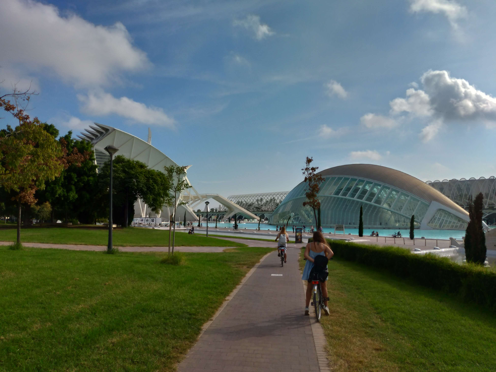

L'Hemisferic from the Park

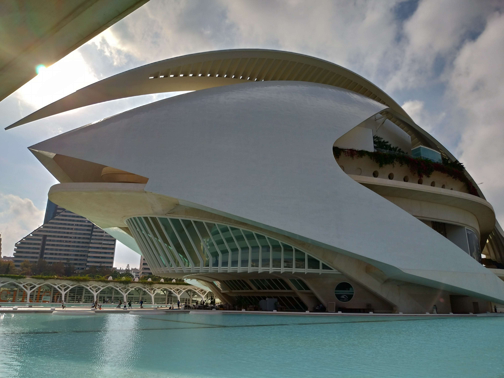

Palau de les Arts Reina Sofía

Museu de les Ciències Príncep Felip

L’Àgora

After driving through the park, I went to the beach and enjoyed the fact that the water was still warm enough to swim in the middle of October, whilst my friends in Austria have to walk around with thick jackets already.

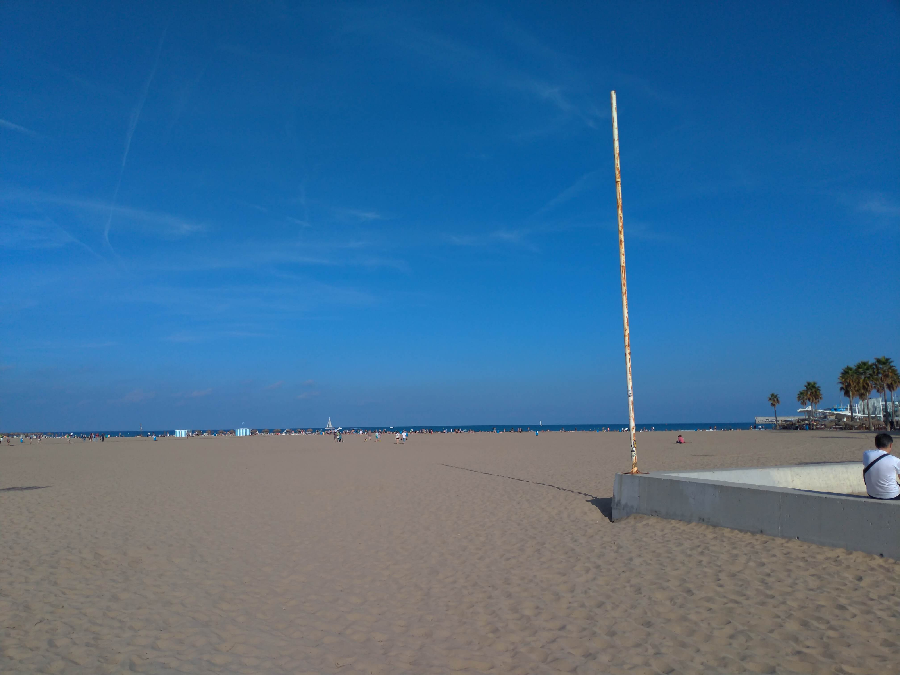

Valencian beach

## Sunday

### Torre De Micalet

Sunday started with the Torre de Micalet, the city's second highest building after the before called bridge. The tower ages way back to the 14th century and consists of 207 steps to get to the top. It is an exhausting but really rewarding walk up there because once you are on the top you can see whole Valencia.

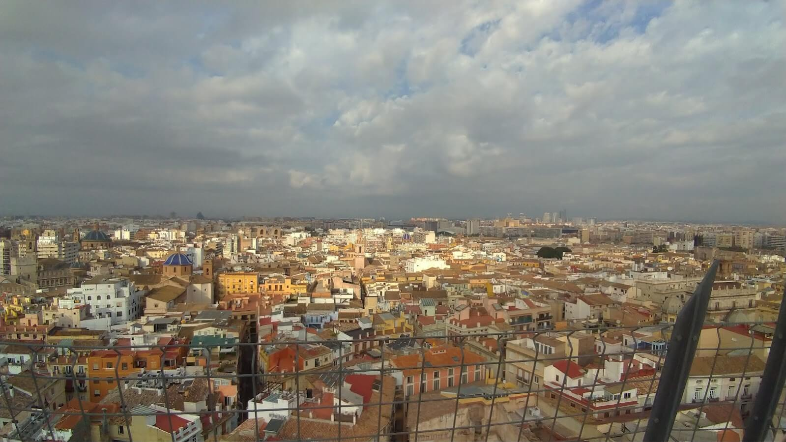

View from the tower 1/2

View from the tower 2/2

### Llojat de la Seda

My last stop was the old fair that was built for the trades on the silk road after Columbus discovered America. The trading house followed the law of the sea and thereby theft was punished with death.

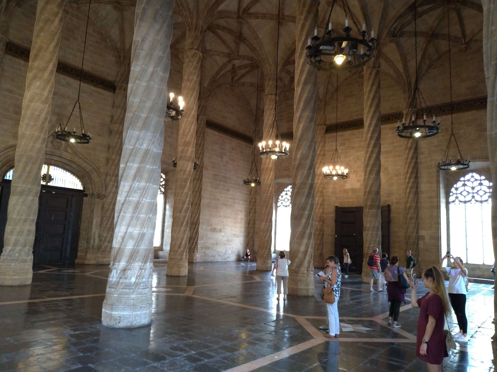

inside the trading house

That pretty much sums up my weekend in Valencia. A beautiful city that I recommend everybody to visit.

I hope to see you again in my next post! <3
